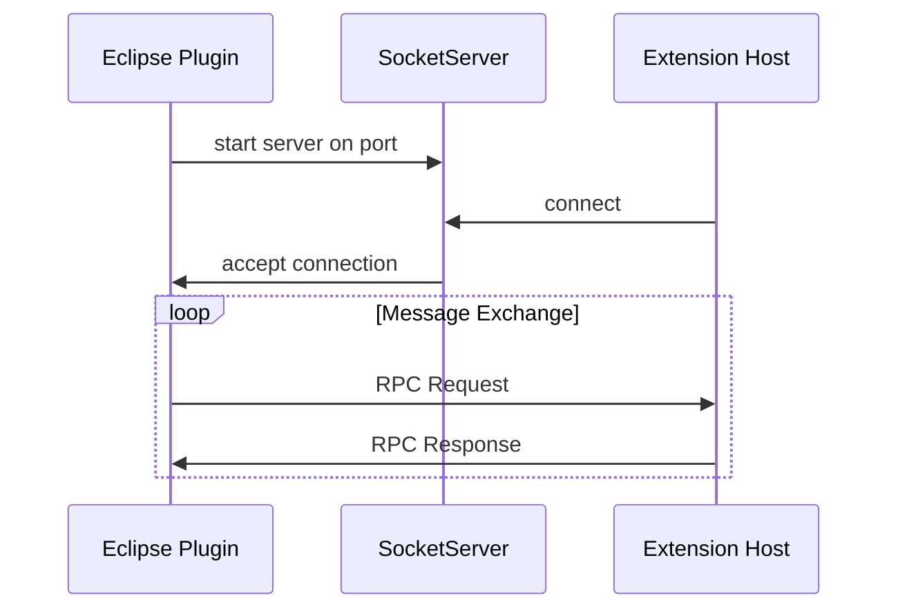
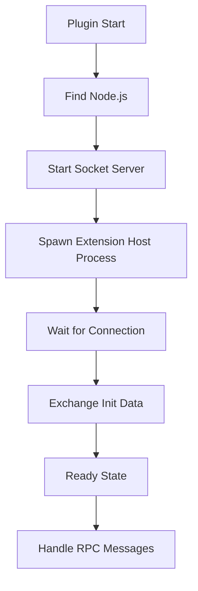

# RunVSAgent Eclipse Plugin - Implementation Plan

## Overview

This document outlines the detailed plan for converting the JetBrains RunVSAgent plugin to an Eclipse plugin. The implementation will use **pure Java** for maximum Eclipse compatibility, **SWT Browser** for WebView functionality, and support **all Eclipse-based IDEs** (Eclipse 2022-09+).

## Architecture Comparison

### JetBrains Plugin vs Eclipse Plugin Mapping

| JetBrains Component | Eclipse Equivalent | Notes |
|---------------------|-------------------|-------|
| `plugin.xml` (IDEA) | `plugin.xml` + `MANIFEST.MF` | Eclipse uses OSGi bundle manifest |
| `ToolWindowFactory` | `ViewPart` | Eclipse views in perspectives |
| `Project` service | `IProject` / Workspace | Eclipse workspace model |
| `Application` service | Platform singleton | Eclipse Platform services |
| JCEF Browser | SWT Browser | Native OS browser widget |
| `Disposable` | Eclipse lifecycle / `IDisposable` | Resource management |
| Gradle build | Maven Tycho | Eclipse plugin build system |
| Kotlin coroutines | Java CompletableFuture | Async handling |

## Project Structure

```
eclipse_plugin/
├── META-INF/
│   └── MANIFEST.MF                    # OSGi bundle manifest
├── plugin.xml                         # Eclipse extension points
├── build.properties                   # Build configuration
├── pom.xml                           # Maven Tycho build
├── icons/                            # Plugin icons
│   ├── runvsagent-16.png
│   ├── runvsagent-32.png
│   └── runvsagent-sidebar.png
├── src/
│   └── com/sina/weibo/agent/eclipse/
│       ├── Activator.java            # Plugin lifecycle
│       ├── StartupHandler.java       # Early startup handler
│       ├── core/
│       │   ├── PluginContext.java
│       │   ├── RPCManager.java
│       │   ├── ExtensionHostManager.java
│       │   ├── ExtensionProcessManager.java
│       │   ├── ExtensionSocketServer.java
│       │   ├── ExtensionManager.java
│       │   ├── WorkspaceManager.java
│       │   └── ServiceProxyRegistry.java
│       ├── ipc/
│       │   ├── ISocket.java
│       │   ├── NodeSocket.java
│       │   ├── PersistentProtocol.java
│       │   ├── ProtocolReader.java
│       │   ├── ProtocolWriter.java
│       │   ├── ProtocolMessage.java
│       │   ├── ChunkStream.java
│       │   └── proxy/
│       │       ├── IRPCProtocol.java
│       │       ├── RPCProtocol.java
│       │       ├── ProxyIdentifier.java
│       │       ├── MessageBuffer.java
│       │       ├── MessageIO.java
│       │       └── PendingRPCReply.java
│       ├── actors/
│       │   ├── MainThreadWebviews.java
│       │   ├── MainThreadWebviewViews.java
│       │   ├── MainThreadDocuments.java
│       │   ├── MainThreadCommands.java
│       │   ├── MainThreadDialogs.java
│       │   ├── MainThreadFileSystem.java
│       │   ├── MainThreadTerminalService.java
│       │   ├── MainThreadClipboard.java
│       │   ├── MainThreadSecretState.java
│       │   ├── MainThreadConfiguration.java
│       │   └── ... (other actors)
│       ├── ui/
│       │   ├── views/
│       │   │   └── RunVSAgentView.java
│       │   ├── dialogs/
│       │   │   └── PluginSelectionDialog.java
│       │   └── widgets/
│       │       └── WebViewComposite.java
│       ├── webview/
│       │   ├── WebViewManager.java
│       │   ├── WebViewInstance.java
│       │   ├── BrowserResourceHandler.java
│       │   └── DragDropHandler.java
│       ├── terminal/
│       │   ├── TerminalManager.java
│       │   └── TerminalInstance.java
│       ├── theme/
│       │   └── ThemeManager.java
│       ├── editor/
│       │   ├── EditorStateService.java
│       │   └── DocumentSyncService.java
│       ├── events/
│       │   ├── EventBus.java
│       │   └── WorkspaceEvents.java
│       └── util/
│           ├── PluginConstants.java
│           ├── PluginResourceUtil.java
│           ├── NodeVersionUtil.java
│           └── URIUtil.java
└── resources/
    └── themes/
        ├── vscode-theme-dark.css
        └── vscode-theme-light.css
```

## Implementation Phases

### Phase 1: Project Setup and Core Framework

**Duration: 2-3 days**

#### 1.1 Create Branch and Project Structure
- Create `eclipse-plugin2` branch
- Set up Maven Tycho project structure
- Configure `MANIFEST.MF` with OSGi dependencies
- Configure `plugin.xml` with extension points

#### 1.2 Implement Plugin Lifecycle
- `Activator.java` - Plugin start/stop lifecycle
- `StartupHandler.java` - Early startup initialization
- `PluginContext.java` - Singleton context for shared state

**Key Files:**

```java
// MANIFEST.MF
Bundle-ManifestVersion: 2
Bundle-Name: RunVSAgent
Bundle-SymbolicName: com.sina.weibo.agent.eclipse;singleton:=true
Bundle-Version: 0.2.5.qualifier
Bundle-Activator: com.sina.weibo.agent.eclipse.Activator
Require-Bundle: org.eclipse.ui,
 org.eclipse.core.runtime,
 org.eclipse.core.resources,
 org.eclipse.ui.ide,
 org.eclipse.ui.console,
 org.eclipse.tm.terminal.view.core,
 org.eclipse.tm.terminal.view.ui
Bundle-RequiredExecutionEnvironment: JavaSE-17
Bundle-ActivationPolicy: lazy
Eclipse-BundleShape: dir
```

### Phase 2: IPC Layer Implementation

**Duration: 3-4 days**

#### 2.1 Socket Communication
- `ISocket.java` - Socket interface
- `NodeSocket.java` - TCP socket implementation with Java NIO
- `ExtensionSocketServer.java` - Server socket for extension host

#### 2.2 Protocol Handling
- `ProtocolMessage.java` - Message format
- `ProtocolReader.java` - Message parsing
- `ProtocolWriter.java` - Message serialization
- `PersistentProtocol.java` - Connection management with keepalive
- `ChunkStream.java` - Byte stream chunking

**Architecture Diagram:**



### Phase 3: RPC System Implementation

**Duration: 4-5 days**

#### 3.1 Core RPC Infrastructure
- `IRPCProtocol.java` - RPC protocol interface
- `RPCProtocol.java` - Full RPC implementation with request/response handling
- `ProxyIdentifier.java` - Service identifier system
- `MessageBuffer.java` - Binary message buffer
- `MessageIO.java` - Message serialization/deserialization

#### 3.2 Service Registration
- `ServiceProxyRegistry.java` - MainThread and ExtHost proxy registration
- Dynamic proxy generation for remote service calls

**Key Concepts:**

```java
// ProxyIdentifier pattern
public class ProxyIdentifier<T> {
    private final String identifier;
    private final boolean isMain;
    private final int nid;
    
    public static <T> ProxyIdentifier<T> createMainIdentifier(String id, int nid) {
        return new ProxyIdentifier<>(id, true, nid);
    }
    
    public static <T> ProxyIdentifier<T> createExtIdentifier(String id, int nid) {
        return new ProxyIdentifier<>(id, false, nid);
    }
}
```

### Phase 4: WebView Implementation with SWT Browser

**Duration: 4-5 days**

#### 4.1 SWT Browser Integration
- `WebViewManager.java` - WebView lifecycle management
- `WebViewInstance.java` - Individual browser instance
- `WebViewComposite.java` - SWT composite wrapper

#### 4.2 Browser Features
- JavaScript bridge using `BrowserFunction`
- Resource interception using `LocationListener`
- Theme injection
- Drag and drop support

**SWT Browser vs JCEF Mapping:**

| JCEF Feature | SWT Browser Equivalent |
|--------------|----------------------|
| `CefBrowser` | `Browser` |
| `executeJavaScript()` | `browser.execute()` |
| `CefMessageRouter` | `BrowserFunction` |
| `CefResourceHandler` | `LocationListener` + local HTTP server |
| `CefLoadHandler` | `ProgressListener` |

**Key Implementation:**

```java
public class WebViewInstance {
    private Browser browser;
    private String viewId;
    
    public void postMessage(String message) {
        browser.getDisplay().asyncExec(() -> {
            String escaped = message.replace("\\", "\\\\")
                                   .replace("'", "\\'")
                                   .replace("\n", "\\n");
            browser.execute(
                "window.postMessage(" + escaped + ", '*');"
            );
        });
    }
    
    public void setupJSBridge() {
        new BrowserFunction(browser, "postMessageToHost") {
            @Override
            public Object function(Object[] arguments) {
                if (arguments.length > 0) {
                    String message = arguments[0].toString();
                    handleMessageFromWebView(message);
                }
                return null;
            }
        };
    }
}
```

### Phase 5: UI Components

**Duration: 3-4 days**

#### 5.1 Eclipse View Implementation
- `RunVSAgentView.java` - Main view extending `ViewPart`
- View lifecycle management
- Toolbar actions

#### 5.2 Dialogs and Widgets
- `PluginSelectionDialog.java` - Extension selection
- System info display

**Extension Point Configuration:**

```xml
<!-- plugin.xml -->
<extension point="org.eclipse.ui.views">
    <category
        id="com.sina.weibo.agent.eclipse.category"
        name="RunVSAgent"/>
    <view
        id="com.sina.weibo.agent.eclipse.view"
        name="RunVSAgent"
        icon="icons/runvsagent-16.png"
        category="com.sina.weibo.agent.eclipse.category"
        class="com.sina.weibo.agent.eclipse.ui.views.RunVSAgentView"
        allowMultiple="false"/>
</extension>

<extension point="org.eclipse.ui.perspectiveExtensions">
    <perspectiveExtension targetID="*">
        <view
            id="com.sina.weibo.agent.eclipse.view"
            relative="org.eclipse.ui.views.ContentOutline"
            relationship="stack"
            visible="false"/>
    </perspectiveExtension>
</extension>
```

### Phase 6: Extension Host Management

**Duration: 3-4 days**

#### 6.1 Process Management
- `ExtensionProcessManager.java` - Node.js process lifecycle
- Node.js version detection
- Environment variable setup

#### 6.2 Extension Host Communication
- `ExtensionHostManager.java` - Message handling
- Initialization data exchange
- State management

**Process Flow:**



### Phase 7: MainThread Actors

**Duration: 5-6 days**

Implement Eclipse equivalents for all VSCode API bridges:

#### 7.1 Document Management
- `MainThreadDocuments.java` - Document open/save/sync
- `MainThreadTextEditors.java` - Editor operations
- `MainThreadBulkEdits.java` - Workspace edits

#### 7.2 UI Services
- `MainThreadWebviews.java` - WebView HTML/messages
- `MainThreadWebviewViews.java` - WebView providers
- `MainThreadDialogs.java` - File dialogs
- `MainThreadWindow.java` - Window state

#### 7.3 System Services
- `MainThreadFileSystem.java` - File operations
- `MainThreadClipboard.java` - Clipboard access
- `MainThreadSecretState.java` - Secure storage
- `MainThreadConfiguration.java` - Settings

#### 7.4 Terminal Services
- `MainThreadTerminalService.java` - Terminal creation/management

**Actor Pattern:**

```java
public interface MainThreadDocumentsShape {
    CompletableFuture<Map<String, Object>> tryCreateDocument(Map<String, Object> options);
    CompletableFuture<Map<String, Object>> tryOpenDocument(Map<String, Object> uri, Map<String, Object> options);
    CompletableFuture<Boolean> trySaveDocument(Map<String, Object> uri);
}

public class MainThreadDocuments implements MainThreadDocumentsShape {
    private final IWorkspace workspace;
    
    @Override
    public CompletableFuture<Map<String, Object>> tryOpenDocument(
            Map<String, Object> uri, Map<String, Object> options) {
        return CompletableFuture.supplyAsync(() -> {
            // Eclipse-specific implementation
            IFile file = workspace.getRoot().getFileForLocation(path);
            IWorkbenchPage page = PlatformUI.getWorkbench()
                .getActiveWorkbenchWindow().getActivePage();
            IEditorPart editor = IDE.openEditor(page, file);
            // Return document info
            return createDocumentInfo(editor);
        });
    }
}
```

### Phase 8: Terminal Integration

**Duration: 2-3 days**

#### 8.1 Eclipse Terminal Integration
- Use `org.eclipse.tm.terminal` for terminal support
- `TerminalManager.java` - Terminal lifecycle
- `TerminalInstance.java` - Individual terminal

**Note:** Eclipse terminal integration differs significantly from JetBrains. Consider using Eclipse TM Terminal or Console view.

### Phase 9: Theme Management

**Duration: 1-2 days**

#### 9.1 Theme Detection and Application
- `ThemeManager.java` - Detect Eclipse theme
- CSS injection into SWT Browser
- Theme change listeners

```java
public class ThemeManager {
    public boolean isDarkTheme() {
        Display display = Display.getDefault();
        Color bg = display.getSystemColor(SWT.COLOR_WIDGET_BACKGROUND);
        double brightness = (0.299 * bg.getRed() + 
                           0.587 * bg.getGreen() + 
                           0.114 * bg.getBlue()) / 255.0;
        return brightness < 0.5;
    }
}
```

### Phase 10: Build and Packaging

**Duration: 1-2 days**

#### 10.1 Maven Tycho Configuration
- Parent POM with Tycho plugins
- Update site generation
- P2 repository

**pom.xml:**

```xml
<project>
    <modelVersion>4.0.0</modelVersion>
    <groupId>com.sina.weibo.agent</groupId>
    <artifactId>com.sina.weibo.agent.eclipse</artifactId>
    <version>0.2.5-SNAPSHOT</version>
    <packaging>eclipse-plugin</packaging>
    
    <properties>
        <tycho.version>3.0.4</tycho.version>
        <project.build.sourceEncoding>UTF-8</project.build.sourceEncoding>
    </properties>
    
    <repositories>
        <repository>
            <id>eclipse-2022-09</id>
            <layout>p2</layout>
            <url>https://download.eclipse.org/releases/2022-09</url>
        </repository>
    </repositories>
    
    <build>
        <plugins>
            <plugin>
                <groupId>org.eclipse.tycho</groupId>
                <artifactId>tycho-maven-plugin</artifactId>
                <version>${tycho.version}</version>
                <extensions>true</extensions>
            </plugin>
            <plugin>
                <groupId>org.eclipse.tycho</groupId>
                <artifactId>target-platform-configuration</artifactId>
                <version>${tycho.version}</version>
                <configuration>
                    <environments>
                        <environment>
                            <os>win32</os>
                            <ws>win32</ws>
                            <arch>x86_64</arch>
                        </environment>
                        <environment>
                            <os>linux</os>
                            <ws>gtk</ws>
                            <arch>x86_64</arch>
                        </environment>
                        <environment>
                            <os>macosx</os>
                            <ws>cocoa</ws>
                            <arch>x86_64</arch>
                        </environment>
                    </environments>
                </configuration>
            </plugin>
        </plugins>
    </build>
</project>
```

## Risk Assessment and Mitigation

### High Risk Areas

| Risk | Impact | Mitigation |
|------|--------|------------|
| SWT Browser limitations | WebView rendering issues | Test on all platforms, fallback UI |
| Terminal integration complexity | Limited terminal features | Use Console view as fallback |
| OSGi classloader issues | Runtime errors | Proper bundle dependencies |
| Eclipse API differences | Feature gaps | Abstract common operations |

### Platform-Specific Considerations

1. **Windows**: SWT Browser uses Edge WebView2 on modern Windows
2. **macOS**: SWT Browser uses WebKit
3. **Linux**: SWT Browser uses WebKitGTK - may have limitations

## Testing Strategy

### Unit Tests
- Core IPC components
- RPC protocol encoding/decoding
- Utility functions

### Integration Tests
- Extension host communication
- WebView message passing
- Document operations

### Manual Testing
- All Eclipse IDEs (Java, C/C++, PHP, etc.)
- All supported platforms
- Theme switching
- Extension activation

## Timeline Summary

| Phase | Description | Duration |
|-------|-------------|----------|
| 1 | Project Setup and Core Framework | 2-3 days |
| 2 | IPC Layer Implementation | 3-4 days |
| 3 | RPC System Implementation | 4-5 days |
| 4 | WebView with SWT Browser | 4-5 days |
| 5 | UI Components | 3-4 days |
| 6 | Extension Host Management | 3-4 days |
| 7 | MainThread Actors | 5-6 days |
| 8 | Terminal Integration | 2-3 days |
| 9 | Theme Management | 1-2 days |
| 10 | Build and Packaging | 1-2 days |
| **Total** | | **28-38 days** |

## Dependencies

### Required Eclipse Plugins/Bundles
- `org.eclipse.ui` - Basic UI framework
- `org.eclipse.core.runtime` - Runtime support
- `org.eclipse.core.resources` - Workspace/project model
- `org.eclipse.ui.ide` - IDE integration
- `org.eclipse.ui.console` - Console view
- `org.eclipse.tm.terminal.view.core` - Terminal support (optional)
- `org.eclipse.jface` - JFace widgets

### External Dependencies
- Gson (JSON processing) - bundled
- OkHttp (HTTP client) - bundled if needed

## Next Steps

1. **Approve this plan** - Review and confirm the implementation approach
2. **Create branch** - Create `eclipse-plugin2` branch
3. **Begin Phase 1** - Set up project structure
4. **Iterative development** - Implement phases sequentially with testing

---

*Document Version: 1.0*
*Last Updated: 2025-12-05*
